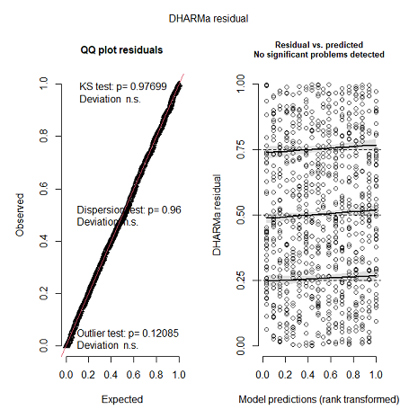

```{r setup, include=FALSE}

#Limpieza de entorno
rm(list = ls(all.names = TRUE))
gc()
#Fijamos decimales
options(digits=4)

knitr::opts_chunk$set(echo = FALSE,
                      fig.align = "center",
                      fig.pos = "H", 
                      fig.dim = c(5,3))

#Importamos librerias
library(multcomp) # Pruebas simultaneas
library(purrr)   # Para utilizar la función map(), map2(), pmap(), ...
library(car)     # Para utilizar la función boxTidwell() y ncvTest().
library(broom) # Test normalidad
library(nortest) # Test normalidad (J.B)
library(latex2exp) # Test aleatoriedad
library(purrr) # pmap function
library(dplyr) # Para el manejo de datos.
library(ggplot2) # Para gráficas.
library(GGally) # Graficas globales
library(kableExtra) # Para tablas más presentables

#Cargamos datos
setwd("C:/Users/JOSUE/Documents/Est.Automatizada/TE1")
#Seleccionamos variables de interes y factorizamos
#Y = bpdiast; 
#X = (bmi, sex, age)
Data1B <- read.csv("Preg1B.csv") %>% 
         dplyr::select(bpdiast, bmi, sex, age) 

#La variable sex (1-hombre, 2-mujer) debe factorizarse
str(Data1B)
Data1B$sex = factor(Data1B$sex, levels = c(1,2), labels = c("hombre", "mujer"))
```

\newpage

# Ejercicio 1

## Datos

La base de datos $Preg1B.csv$ contiene información sobre $400$ pacientes seleccionados de forma aleatoria. Se desea analizar si existe una asociación entre la presión arterial diastólica (bpdiast) y el índice de masa corporal (bmi), en particular, si es posible observar que tener un índice de masa corporal alto se asocia con una alta presión arterial diastólica. Para realizar este análisis se considera el sexo (sex: 1-hombre, 2-mujer) y la edad (age) de los pacientes, pues la presión arterial diastólica podría variar de acuerdo con estos factores.

## Análisis Descriptivo

### Estadísticas básicas
```{r EstDes}
#Nombrar chunks para referencias
Data1B %>% group_by(sex) %>% 
  summarise(Observaciones = n(),
            Media = round(mean(bpdiast),2),
            Mediana = round(median(bpdiast),2),
            Varianza = round(var(bpdiast),2)) %>% 
  
  #Formato de tabla
  kable(booktabs = T, 
        align = "c", 
        linesep = "", 
        caption = "Principales estadísticas de Presión diastólica por Sexo") %>%
  kable_styling(latex_options = "HOLD_position")

```

A partir del Cuadro \@ref(tab:EstDes) observamos lo siguiente:

```{=tex}
\begin{itemize}
  \item El número de observaciones es disparejo ($n=185$ para hombres y $n=215$ para mujeres) para cada Sexo.
  \item En promedio, la Presión Diastólica en Hombres (84.5) es mayor a la de las Mujeres (81.7).
  \item Notamos mayor variabilidad de la presión para las mujeres y menor variabilidad para los hombres.
\end{itemize}
```
### Análisis gráfico

Para analizar el efecto del BMI y el Sexo en el valor de la Presión Diastólica, se realizó una gráfica tipo Scatter Plot y un BoxPlot (Figura \@ref(fig:ScatterPlot)) diferenciando cada observación por medio del Sexo mediante color y forma.

```{r ScatterPlot, fig.cap = "Diagrama de dispersión y boxplot considerando como variable de interés a la Presión Diastólica. El valor de BMI se considera como una variable de ajuste y cada paciente observado se represente a través de un color y forma diferente, dependiendo su sexo.", fig.show="hold", out.width="48%",out.hight="80%",fig.align='center'}
par(mar=c(2,2,2,2))
ggplot(Data1B, aes(x=bmi, y=bpdiast, color=sex, shape = sex)) +
  geom_point() +
  labs(title = "Bpdiast v.s Bmi",
       x = "bmi",
       y = "bpdiast") +
  theme_bw()
boxplot(bpdiast ~ sex, data = Data1B, col = "white", outline=FALSE, xlab = NULL)
  stripchart(bpdiast ~ sex, data = Data1B,
             method = "jitter",
             pch = 19,
             col = 2:4,
             vertical = TRUE,
             add = TRUE)
  title("Bpdiast v.s Sex")
```

A partir de la Figura \@ref(fig:ScatterPlot) observamos lo siguiente:

```{=tex}
\begin{itemize}
  \item Existe una correlación positiva entre BMI y Presión Diastólica en valores del BMI menores a 33, considerando tanto a hombres como mujeres.
  \item Para valores del BMI mayores a 33, hay una predominancia de mujeres con elevados niveles de presión diastólica.
  \item Para valores de BMI menores a 33, los hombres parecen poseer mayores niveles de presión diastólica que mujeres. 
  \item Los valores de la Presión Diastólica se concentran en 80-90 para hombres mientras que para mujeres están más dispersos.
\end{itemize}
```

## Ajuste de Modelo
Comenzamos ajustando un modelo de regresión lineal múltiple para $E(Y_i;\mathrm{bmi},\mathrm{sex},\mathrm{age})$ considerando la variable bmi como el principal ajuste y sin tomar en cuenta interacciones, notando que el nivel de referencia para la variable categórica `sex` es `hombres`. De tal modo que, la parametrización queda como sigue:
\begin{equation*}
 \mathrm{E}(Y_i;x_{i1}=\mathrm{bmi},x_{i2}=\mathrm{sex},x_{i3}=\mathrm{age}) = \beta_0 + \beta_1x_{i1} + \beta_2x_{i\mathrm{M}} + \beta_3x_{i3}
\end{equation*}

Posteriarmente, se evaluó si este modelo es adecuado para modelar la esperanza. De no ser el caso, sería necesario realizar cambios. En este caso, se observó que el modelo pasó la prueba de significancia de la regresión (se rechazó que los coeficientes $B_i$ en conjunto sean cero); es decir, las covariables utilizadas, en conjunto, aportan información suficiente para modelar $E(Y_i = bpdiast)$.

Sin embargo, como se puede apreciar en la Figura \@ref(fig:Residuals1), se rechaza que exista linealidad entre la covariable Edad con respecto a la Presión Diastólica. Y en general, el modelo ajustado falla dicho supuesto con una significancia del 5%. Así mismo, no se cumple el supuesto de normalidad aunque sí el de homocedasticidad.

```{r Residuals1, fig.cap = "Gráficos de residuales de Pearson vs Edad y Valores ajustados. Notar que la línea azul es lo suficientemente curva para detectar un problema de linealidad. Anexo se presenta la prueba de hipótesis de linealidad, donde $H_0$ = Cumple Linealidad y se rechaza para ambas pruebas.", out.width= "60%", out.height= "70%"}
Ajuste1 <- lm(formula = bpdiast~.,
              data = Data1B)
residualPlots(Ajuste1, terms = ~ age, )
```
Ante la insuficiencia del primer modelo planteado, se emplearon otros 2 modelos potenciales; uno en el que le aplicó la transformación BoxTidwell para tratar la no linealidad, y otro modelo al cual se le aplicó la transformación Box-Cox a la variable `bpdiast` y donde se minimizó el AIC a través de una búsqueda exhaustiva de transformaciones a las covariables contínuas. A continuación, se presentan los 2 modelos resultantes:

Modelo con transformación Box-Tidwell
\begin{equation*}
 \mathrm{E}(Y_i;x_{i1}=\mathrm{bmi},x_{i2}=\mathrm{sex},x_{i3}=\mathrm{age^{-1}}) = \beta_0 + \beta_1x_{i1} + \beta_2x_{i\mathrm{M}} + \beta_3x_{i3}^{-1}
\end{equation*}

Modelo con transformación Box-Cox y transformación de Covariables con AIC mínimo
\begin{equation*}
  \mathrm{E}(ln(Y_i);x_{i1}=\mathrm{bmi^{1.7}},x_{i2}=\mathrm{sex},x_{i3}=\mathrm{age^{-0.8}}) = \beta_0 + \beta_1x_{i1}^{1.7} + \beta_2x_{i\mathrm{M}} + \beta_3x_{i3}^{-0.8}
\end{equation*}

El primer modelo cumplió el supuesto de linealidad más no el de normalidad. En cambio, el 2° modelo cumplió todos los supuestos y obtuvo el menor AIC de entre todos los modelos, como se puede apreciar en el Cuadro \@ref(tab:AICT) . Por lo que optamos por elegir al segundo modelo como el indicado para contestar la problemática planteada.

Es preciso notar que, la transformación $ln()$ sobre la variable dependiente $Y$, conlleva una pérdida en la interpretabilidad de las $B_i$, aunado al hecho de que ya no se puede modelar directamente la Esperanza de la Presión Diastólica ($E(Y_i = bpdiast)$) en la escala original, sino su Mediana ($Med(Y_i = bpdiast)$) a través de la transformación $e^{E(ln(Y_i); X)}$. Esto se cumple bajo el supuesto de normalidad con $ln(y_i) = y_i^* \sim N\left(\mathrm{E}(y^* ; x), \sigma^2\right)$, donde resulta que $E(y_i^*; X) = Med(y_i^*; X)$.

Note que ambos modelos pasan la prueba de significancia de la regresión.

```{r AICT}
#Crear el vector de valores
AIC <- c(3068, 3064, 3055)

#Crear el dataframe con los títulos y los valores
df <- data.frame(AIC = AIC)
row.names(df) <- c("RLM sin interacciones", "RLM + Box-Tidwell", "RLM + Box-Cox + Potencias")
  
#Formato de tabla
kable(df, booktabs = T,
      align = c("c", "c"), 
      linesep = "",
      caption = "AIC por cada modelo ajustado") %>%
  kable_styling(latex_options = "HOLD_position")
```
Entonces, las expresiones del modelo ajustado para el logaritmo de la Presión Diastólica por cada sexo se describen en la expresión \ref{eqn:Exp1}.

\begin{align}
\widehat{\mathrm{E}}(ln(Y_i);x_{i1}^{1.7},\mathrm{sex},x_{i3}^{-0.8}) &=
  \begin{cases}
    \widehat{\beta}_0 + \widehat{\beta}_1x_{i1}^{1.7} + \widehat{\beta}_3x_{i3}^{-0.8}, & \text{Si el individuo } i \text{ es hombre} \\
    \\
    (\widehat{\beta}_0 + \widehat{\beta}_2) + \widehat{\beta}_1x_{i1}^{1.7} + \widehat{\beta}_3x_{i3}^{-0.8}, & \text{Si el individuo } i \text{ es mujer} \\
  \end{cases} \nonumber \\ \nonumber \\
  &= \begin{cases}
    4.459 + 0.0003x_{i1}^{1.7} - 2.478x_{i3}^{-0.8}, & \text{Si el individuo } i \text{ es hombre} \\
    \\
    4.412 + 0.0003x_{i1}^{1.7} - 2.478x_{i3}^{-0.8}, & \text{Si el individuo } i \text{ es mujer} \\
  \end{cases} \label{eqn:Exp1}
\end{align}
Se observa que las pendientes de las rectas, en la expresión \ref{eqn:Exp1}, son iguales entre sí y solo difieren en su ordenada al origen, del cual se puede percibir que, ante una transformación exponencial la esperanza estimada, la mediana de la Presión Diastólica para hombres será mayor que para mujeres.

Con un análisis del cuadro \ref{tab:BOut}, se aprecia una pequeña influencia en el cambio de las Betas estimadas; sin embargo, al eliminar los Outiliers se afecta el tamaño de la muestra, lo cual puede conllevar a problemas en la comparación del AIC con respecto a otros modelos. Además, dado a que se está modelando, finalmente, la mediana de la Presión Diastólica y no la media, los efectos de estos outliers son menos significativos. Por tanto, se consideró no eliminarlos.

```{r BOut}
#Crear el vector de valores
# Crear una lista con los valores de los coeficientes
betas <- c("Intercept", "I(bmi^1.7)", "sexmujer", "I(age^-0.8)")
ajuste_con_outliers <- c(4.4589275, 0.0003928, -0.0468129, -2.4784519)
ajuste_sin_outliers <- c(4.4648124, 0.0003752, -0.0502400, -2.4648276)

# Convertir en un data frame
datos <- data.frame(Betas = betas, 
                    "Ajuste con outliers" = ajuste_con_outliers, 
                    "Ajuste sin outliers" = ajuste_sin_outliers)

#Formato de tabla
kable(datos, booktabs = T,
      align = "c", 
      linesep = "",
      caption = "Comparación de Betas entre modelo con Outliers vs sin Outliers") %>%
  kable_styling(latex_options = "HOLD_position")
```
## ¿Se puede indicar que para una persona de cierta edad y sexo, tener un índice de masa corporal alto se asocia con una alta presión arterial diastólica?

Para responder la problemática, es necesario realizar la siguiente prueba de hipótesis de una sola dirección:
  \begin{equation*}
  H_0: \beta_1 <= 0  \quad \text{v.s} \quad H_a: \beta_1 > 0 
  \end{equation*}  \label{eqn:E2}
La prueba se rechazó con un $p_{value} < 0.05$, es decir, hay evidencia significativa en contra de que el valor de $B_1 <= 0$ y por lo cual resulta pausible considerar que $B_1 > 0$.

Esta nos permite indicar el coeficiente asociado a la variable bmi es positivo ($B_1$ > 0) dado que los demás factores son constantes; lo que indicaría que, ante valores positivos del BMI, el valor de la Presión Diastólica tendrá un aumento, especialmente para valores altos.

Notemos que la transformación $bmi^{1.7}$ es creciente y la transformación $e^{E(ln(Y_i); X)}$ igual, por lo que la correlación se mantendría en el sentido de, a mayor valor del BMI, la Mediana de la Presión Arterial Diastólica aumentará, con base en los resultados obtenidos en la prueba de hipótesis \ref{eqn:E2}.

## Gráfica con curvas ajustadas
Finalmente, podemos notar esta correlación positiva en la Figura \ref{fig:ScatterPlotAjust}, igualmente, la Presión Diastólica es mayor para hombres que para mujeres e incluso, a mayor Edad mayor Presión.
```{r ScatterPlotAjust, fig.cap = "Diagrama de dispersión de la Presión Arterial Diastólica  vs BMI, ajustando las curvas enunciadas en la expresión \\ref{eqn:Exp1} para las edades 30, 50 y 64. Cada observación y curva se representa a través de un color diferente, dependiendo su sexo.", fig.show="hold", out.width="50%",out.hight="70%",fig.align='center'}

Ajuste3 = lm(formula = log(bpdiast) ~ I(bmi^1.7) + sex + I(age^-0.8), data = Data1B)

#Guardamos coeficientes
b0 <- Ajuste3[["coefficients"]][["(Intercept)"]]
b1 <- Ajuste3[["coefficients"]][["I(bmi^1.7)"]]
b2 <- Ajuste3[["coefficients"]][["sexmujer"]]
b3 <- Ajuste3[["coefficients"]][["I(age^-0.8)"]]

## Rectas de regresión (Modelamos la mediana)
## E(ln(y); bmi^1.7, sexo = hombre, edad x^-.8) = b0 + b1*bmi^1.7 + b3*x^-.8
RA <- function(x, age) {
  exp(b0 + b1*(x^1.7) + b3*(age^-0.8))
}
## E(ln(y), bmi^1.7, sexo = mujer, edad x^-.8) = (b0 + b2) + b1*bmi^1.7 + b3*x^-0.8
RB <- function(x, age) {
  exp((b0 + b2) + b1*(x^1.7) + b3*(age^-0.8))
}

#Generamos los valores estimados para cada combinacion
#entre edad y sexo
bmi_df <- data.frame(bmi = Data1B$bmi)
for (sex in c("Hombre", "Mujer")) {
  for (age in c(30, 50, 64)) {
    col_name <- paste(sex, age, sep = "_")
    if (sex == "Hombre") {
      bmi_df[col_name] <- RA(Data1B$bmi, age)
    } else {
      bmi_df[col_name] <- RB(Data1B$bmi, age)
    }
  }
}

#Función que ajusta tamaño de las leyendas
addSmallLegend <- function(myPlot, pointSize = 3, textSize = 6, spaceLegend = 0.7) {
    myPlot +
        guides(shape = guide_legend(override.aes = list(size = pointSize)),
               color = guide_legend(override.aes = list(size = pointSize))) +
        theme(legend.title = element_text(size = textSize), 
              legend.text  = element_text(size = textSize),
              legend.key.size = unit(spaceLegend, "lines"))
}

#Extendemos a lo largo el dataframe para graficar
asas <- tidyr::gather(bmi_df, key = measure, value = regression, 
               colnames(bmi_df)[-1])

#Graficamos dispersion y los 3 pares de rectas  ajustadas
#Cambiamos nombre de columna
colnames(Data1B)[colnames(Data1B) == "sex"] <- "Sexo"
p = ggplot(Data1B, aes(x = bmi,
                       y = bpdiast)) +
  geom_point(aes(color = Sexo,
                  shape = Sexo), size = 1, alpha = 0.5) +
  labs(title = "Presion Arterial v.s BMI a Diferentes Edades",
       x = "bmi",
       y = "bpdiast") +
  geom_line(data= asas, aes(x = bmi, y = regression, group = measure, color = measure)) +
  labs(color = "Sexo y Edad") +
  theme(legend.spacing.y = unit(.2, 'cm'))

addSmallLegend(p)
```
Por lo tanto, podemos concluir que, para una persona de cierta edad y sexo, tener un índice de masa corporal alto se asocia con una alta presión arterial diastólica con una confianza del 95%.

```{r setup2, include=FALSE}

#Limpieza de entorno
rm(list = ls(all.names = TRUE))
gc()
#Fijamos decimales
options(digits=4)

library(tidyverse) #Manipulacion de datos
library(ggplot2) #Estilizacion de graficas
library(DHARMa) #Verificacion de supuestos
library(multcomp) #Pruebas simultaneas
library(VGAM) #Ajuste de MLG con otras distribuciones
library(MASS) #Funciones de soporte
library(kableExtra) #Estilizacion de tablas

# Cargamos los datos
datos <- read.csv("Preg1B.csv")
datos$sex <- factor(datos$sex, levels = c(1, 2), labels = c("Hombre", "Mujer")) 

```

\newpage

# Ejercicio 2

Usando los datos del Ejercicio 1 se buscó entre un conjunto de modelos previamente determinados aquellos que tuvieran el menor AIC y BIC. 

## Selección de modelo

Se consideraron varias opciones para el componente lineal, las distribuciones y la función liga:

```{=tex}
\begin{itemize}
  \item Distribuciones: normal, gamma, inversa gaussiana.
  \item Liga: inversa, identidad, logaritmo, $1/x^2$ (solo Inv.Gauss).
  \item Componente lineal: polinimios hasta grado 5 y potencias entre -3 y 3 en intervalos de 0.5 (para la potencia 0 se considera la transformación log de la covariable).
\end{itemize}
```

Se ajustó un modelo para cada posible combinación del componente lineal, distribución y función liga, dando un total de 6,480 modelos.

Se guardó cada componente de la combinación en una lista, así como el respectivo AIC y BIC para posteriormente acceder a todos los modelos ajustados.


```{r seleccion de modelos 2, include = FALSE}

# Cargamos los datos
datos <- read.csv("Preg1B.csv")
datos$sex <- factor(datos$sex, levels = c(1, 2), labels = c("Hombre", "Mujer")) 

#### 2.1 ####

# Funcion para crear los polinimios y potencias de la covariable cov
# gPoly = grado máximo del polinomio
# gPot = grado máximo de la potencia
malla <- function(cov, gPoly, gPot) {
  Poly <- paste0("poly(", cov, ", ", 1:gPoly, ", raw = TRUE)")
  
  Pot <- paste0("I(", cov, "^(", seq(from = -gPot, to = gPot, by = 0.5), "))")
  idx0 <- (length(seq(from = -gPot, to = gPot, by = 0.5)) + 1)/2
  Pot[idx0] <- paste0("I(log(", cov, "))")
  
  return(c(Poly, Pot))
}

# Los polinomios y potencias para cada variable
bmiMalla <- malla("bmi", gPoly = 5, gPot = 3)
ageMalla <- malla("age", gPoly = 5, gPot = 3)
sexMalla <- c("sex", "NULL")

# Todas las posibles combinaciones entre las covariables
mallaTotal <- expand.grid(sexMalla, bmiMalla, ageMalla, stringsAsFactors = FALSE)

# Creamos los caracteres como apareceran en la formula
CompLin <- apply(mallaTotal, 1, function(x) {paste0("bpdiast ~ ", paste(x, collapse = " + "))})


# Posibles distribuciones
Distribuciones <- c("gaussian", "Gamma", "inverse.gaussian")

# Posibles funciones liga
# i) inverse
# ii) identity
# iii) log
# iv) 1/mu^2 (sólo IG)
FunLigas <- c("identity", "log", "inverse", "1/mu^2")


# Creamos algunas variables
nFunLigas <- length(FunLigas)
nDist <- length(Distribuciones)
nCompLin <- length(CompLin)

nModelos <- nCompLin * (2 * 3 + 4) # Total de modelos (tres funciones ligas para 2 dist y 4 para una IG) 
ModelList <- vector(mode = "list", length = nModelos)  # guardar resultados del ajuste, objeto glm
AICList <- vector(mode = "list", length = nModelos)    # guardar el AIC del modelo
BICList <- vector(mode = "list", length = nModelos)    # guardar el BIC del modelo
FormList <- vector(mode = "list", length = nModelos)   # guardar la fórmula usada para el ajuste


index=0
for(k in 1:nCompLin) {
  formstring <- CompLin[k]
  form <- formula(formstring)
  for(j in 1:nDist) {
    for(l in 1:nFunLigas) {
      # definición del argumento family
      if(FunLigas[l]=="1/mu^2") {
        if(Distribuciones[j]=="inverse.gaussian") {
          index <- index+1
          Dist <- get(Distribuciones[j])  #obtener la función a usar
          Mod.A.Prueba <- glm(form, data = datos, family = Dist(link=FunLigas[l]))
          ModelList[[index]] <- Mod.A.Prueba
          AICList[[index]] <- AIC(Mod.A.Prueba)
          BICList[[index]] <- BIC(Mod.A.Prueba)
          FormList[[index]] <- formstring
        }
      } else {
        index <- index+1
        Dist <- get(Distribuciones[j])
        Mod.A.Prueba <- glm(form, data=datos, family = Dist(link=FunLigas[l]))
        ModelList[[index]] <- Mod.A.Prueba
        AICList[[index]] <- AIC(Mod.A.Prueba)
        BICList[[index]] <- BIC(Mod.A.Prueba)
        FormList[[index]] <- formstring
      }
    }
  }
}


# Modelo con menor AIC
MinAIC <- which.min(unlist(AICList)) # indice

ModMinAIC <- ModelList[[MinAIC]]
summary(ModMinAIC)

ModMinAIC$family

AICList[[MinAIC]]
BICList[[MinAIC]]
FormList[[MinAIC]]

# Modelo con menor AIC

# E[Y] = beta_0 + beta_1 * x_Mujer + beta_2 * x_BMI^2 + beta_3 * x_Age + beta_4 * x_Age^2


# Modelo con menor BIC
MinBIC <- which.min(unlist(BICList))

ModMinBIC <- ModelList[[MinBIC]] # indice
summary(ModMinBIC)

ModMinBIC$family

AICList[[MinBIC]]
BICList[[MinBIC]]
FormList[[MinBIC]]

# Modelo con menor BIC

# E[Y] = beta_0 + beta_1 * x_Mujer + beta_2 * x_BMI^2 + beta_3 * x_Age^{-0.5}


# Ambos modelos tienen una distribución Gamma con función liga identidad y misma forma
# para las covariables sexo y BMI.
# Por lo que consideramos el modelo con menor BIC, ya que además su AIC no difere mucho
# al modelo con menor AIC.


```

El modelo con menor AIC fue el siguiente:

\begin{equation*}
 \mathrm{E}(bpdiast) = \beta_0 + \beta_1 x_{Mujer} + \beta_2 x_{BMI}^2 + \beta_3 x_{Age} + \beta_4 x_{Age}^2.
\end{equation*}

Mientras que el modelo con menor BIC fue el siguiente:

\begin{equation*}
 \mathrm{E}(bpdiast) = \beta_0 + \beta_1 x_{Mujer} + \beta_2 x_{BMI}^2 + \beta_3 x_{Age}^{-0.5}.
\end{equation*}

Ambos modelos toman una distribución Gamma con función liga identidad y tienen la misma forma funcional para el sexo y el BMI.

El AIC y BIC para ambos modelos se presenta en el Cuadro \@ref(tab:ModelosAIC2).

```{r ModelosAIC2, include = TRUE}

criterios <- data.frame(Modelo = c("Mínimo AIC",
                                   "Mínimo BIC"),
                        AIC = c(AICList[[MinAIC]], AICList[[MinBIC]]),
                        BIC = c(BICList[[MinAIC]], BICList[[MinBIC]]))

#Formato de tabla
kable(criterios, booktabs = T,
      align = c("c", "c"), 
      linesep = "",
      caption = "AIC y BIC para cada modelo") %>%
  kable_styling(latex_options = "HOLD_position")


```


Se observa que el AIC del modelo con menor BIC no difiere mucho al del modelo con menor AIC. Además, el modelo con menor BIC tiene menos parámetros para la covariable $Age$, por lo que este parece un mejor modelo con el que trabajar.


## ¿Se puede indicar que para una persona de cierta edad y sexo, tener un índice de masa corporal alto se asocia con una alta presión arterial diastólica?

El modelo seleccionado se presenta en la expresión \ref{eqn:Eh}.

\begin{equation*}
 \mathrm{E}(bpdiast) = \beta_0 + \beta_1 x_{Mujer} + \beta_2 x_{BMI}^2 + \beta_3 x_{Age}^{-0.5}.
\end{equation*} \label{eqn:Eh}

Note que al modelo \ref{eqn:Eh} se le asoció una distribución Gamma y función liga identidad.

De acuerdo al criterio de la primera derivada, el valor esperado de la presión arterial diastólica (bpdiast) es creciente con respecto al BMI, tomando al sexo y edad fijos, si $2 \beta_2 x_{BMI} > 0$, esto es, si $\beta_2 > 0$ ya que $x_{BMI}$ siempre es mayor a 0.

Por lo que se realizó la siguente prueba de hipótesis:

\begin{equation*}
H_0: \beta_2 \leq 0 
\qquad  H_1: \beta_2 > 0.
\end{equation*}

```{r relacion creciente 2, include = TRUE}

#### 2.2 ####

# De acuerdo al criterio de la primera derivada, la presión arterial diastólica es
# creciente con respecto al BMI, tomando al sexo y edad fijos, si 2 * beta_2 * x_BMI > 0,
# esto es, sí beta_2 > 0 ya que x_BMI siempre es mayor a 0

# Realizamos la prueba de hipótesis
# H0: beta_2 <= 0 vs
# H1: beta_2 > 0

K <- matrix(c(0, 0, 1, 0), byrow = TRUE, nrow = 1)
m = 0

summary(glht(ModMinBIC, linfct = K, rhs = m, alternative = "greater"))

# Tenemos un p-value < 0.05. Por lo que rechazamos H0 en favor a H1.

# Podria decirse que la presión arterial diastólica es creciente 
# con respecto al BMI, tomando al sexo y edad fijos


```

Se obtuvo un $p-value < 0.05$, por lo que rechazamos $H_0$ en favor a $H_1$. Así que se puede indicar que para una persona de cierta edad y sexo, tener un índice de masa corporal alto se asocia con una alta presión arterial diastólica.


## Gráficas con curvas ajustadas

Finalmente, podemos notar esta correlación positiva en la Figura \@ref(fig:curvas2), al igual que Presión Diastólica es mayor para hombres que para mujeres e, incluso, a mayor Edad mayor Presión.


```{r curvas2, fig.cap = "Curvas del modelo ajustado con menor BIC para las edades 30, 50 y 64, y cada sexo. Además se grafican los datos observados.", fig.show="hold", out.width="48%",out.hight="80%",fig.align='center'}

# Guardamos coeficientes
b0 <- ModMinBIC[["coefficients"]][["(Intercept)"]]
b1 <- ModMinBIC[["coefficients"]][["sexMujer"]]
b2 <- ModMinBIC[["coefficients"]][["I(bmi^(2))"]]
b3 <- ModMinBIC[["coefficients"]][["I(age^(-0.5))"]]

# Curvas de regresión
# E[Y] = beta_0 + beta_2 * x_BMI^2 + beta_3 * x_Age^{-0.5}
RA <- function(x, age) {
  b0 + b2*(x^2) + b3*(age^-0.5)
}
# E[Y] = beta_0 + beta_1 + beta_2 * x_BMI^2 + beta_3 * x_Age^{-0.5}
RB <- function(x, age) {
  (b0 + b1) + b2*(x^2) + b3*(age^-0.5)
}

# Generamos los valores estimados para cada combinacion
# entre edad y sexo
bmi_df <- data.frame(bmi = datos$bmi)
for (sex in c("Hombre", "Mujer")) {
  for (age in c(30, 50, 64)) {
    col_name <- paste(sex, age, sep = "_")
    if (sex == "Hombre") {
      bmi_df[col_name] <- RA(datos$bmi, age)
    } else {
      bmi_df[col_name] <- RB(datos$bmi, age)
    }
  }
}

#Extendemos a lo largo el dataframe para graficar
asas <- tidyr::gather(bmi_df, key = measure, value = regression, 
                      colnames(bmi_df)[-1])

#Función que ajusta tamaño de las legendas
addSmallLegend <- function(myPlot, pointSize = 3, textSize = 6, spaceLegend = 0.7) {
    myPlot +
        guides(shape = guide_legend(override.aes = list(size = pointSize)),
               color = guide_legend(override.aes = list(size = pointSize))) +
        theme(legend.title = element_text(size = textSize), 
              legend.text  = element_text(size = textSize),
              legend.key.size = unit(spaceLegend, "lines"))
}

# Graficamos dispersion y los 3 pares de rectas  ajustadas
# Cambiamos nombre de columna
colnames(datos)[colnames(datos) == "sex"] <- "Sexo"
p = ggplot(datos, aes(x = bmi,
                       y = bpdiast)) +
  geom_point(aes(color = Sexo,
                 shape = Sexo), size = 1, alpha = 0.5) +
  labs(title = "Presion Arterial v.s BMI a Diferentes Edades",
       x = "bmi",
       y = "bpdiast") +
  geom_line(data= asas, aes(x = bmi, y = regression, group = measure, color = measure)) +
  labs(color = "Sexo y Edad") +
  theme(legend.spacing.y = unit(.2, 'cm'))
addSmallLegend(p)
colnames(datos)[colnames(datos) == "Sexo"] <- "sex"

# En todas las rectas se puede ver una tendencia creciente

# Dado la prueba de hipotesis y la grafica anterior, es posible afirmar que el promedio 
# de la presión arterial diastólica (bpdiast) es creciente con respecto la indice de
# masa corporal (BMI)


```


## Comparación de modelos ajustados

Se ajustaron dos modelos para poder explicar la presión arterial diastólica con las covariables $BMI$, $sex$ y $Age$.

En el modelo 1 se consideró un modelo lineal normal y se recurrió a una transformación Box-Cox y transformaciones tipo potencia ($x^\lambda$):

\begin{equation*}
 \mathrm{E}[log(bpdiast)] = \beta_0 + \beta_1 x_{BMI}^{1.7} + \beta_2 x_{Mujer} + \beta_3 x_{Age}^{-0.8}.
\end{equation*} \label{eqn:Ea}


Para el modelo 2 se recurrió a un modelo lineal generalizado con distribución Gamma, función liga identidad y transformaciones tipo potencia ($x^\lambda$):

\begin{equation*}
 \mathrm{E}(bpdiast) = \beta_0 + \beta_1 x_{Mujer} + \beta_2 x_{BMI}^2 + \beta_3 x_{Age}^{-0.5}.
\end{equation*} \label{eqn:Eb}

Por lo que es de interes conocer cuál de los dos enfoques resulta mejor en este caso.

Realizando una comprobación de supuestos a ambos modelos no se observó ningún problema en ningún modelo.

```{r comparacion2, include = FALSE}

#### 2.3 ####

# Modelo 1: E[ln(bpdiast)] = beta_0 + beta_1 * x_BMI^1.7 + beta_3 * x_Age^{-0.8}
# Y ~ Normal
modelo1 <-  lm(formula = log(bpdiast) ~ I(bmi^1.7) + sex + I(age^-0.8), data = datos)
summary(modelo1)

# Modelo 2: E[bpdiast] = beta_0 + beta_1 * x_Mujer + beta_2 * x_BMI^2 + beta_3 * x_Age^{-0.5}
# Y ~ Gamma
modelo2 <- ModMinBIC
summary(modelo2)

# Comprobacion de supuestos. No parece haber problemas con ningun modelo
plot(modelo1)
plot(modelo2)

# Criterios AIC
# AIC modelo 1 = 3055
AIC(modelo2) # menor AIC

```


En términos del criterio AIC, el modelo 2 parece ser mejor que el modelo 1 como se observa en el Cuadro \@ref(tab:criteriosAIC2). Es necesario recordar que hay que realizar ciertos ajustes para obtener el AIC del modelo 1, ya que se está trabajando con una transformación de la variable dependiente Y-bpdiast.

```{r criteriosAIC2, include = TRUE}

criterios <- data.frame(Modelo = c("Modelo 1",
                                   "Modelo 2"),
                        AIC = c(3055, AIC(modelo2)))

#Formato de tabla
kable(criterios, booktabs = T,
      align = c("c", "c"), 
      linesep = "",
      caption = "AIC para cada modelo") %>%
  kable_styling(latex_options = "HOLD_position")

```


En cuanto a la interpretabilidad, es pertinente considerar lo siguiente:

```{=tex}
\begin{enumerate}
  \item Las observaciones son datos positivos por lo que tiene sentido modelarlos con una distrubición que solo tome valores positivos como la Gamma en el modelo 2. El modelo 1 hace uso de la distribución normal que toma valores positivos y negativos.

  \item En el modelo 1 modelamos el valor esperado de una transformación de los datos (log), por lo que no es posible hacer conclusiones directas sobre las observaciones. Para el modelo 2 modelamos el valor esperado de los datos y es  posible hacer  conclusiones más directas sobre el valor esperado de los datos.

\end{enumerate}
```

Dadas las consideraciones de la distribución, el criterio AIC y la interpretabilidad, es preferible usar el modelo 2, presentado en la expresión \ref{eqn:Eb}.

```{r setup3, include=FALSE}
#Limpieza de entorno
rm(list = ls(all.names = TRUE))
gc()
#Fijamos decimales
options(digits=4)

#Importamos librerias
#Importamos librerias
library(dplyr)   # Para el manejo de datos.
library(purrr)   # Para utilizar la función map(), map2(), pmap(), ...
library(ggplot2) # Para gráficas.
library(car)     # Para utilizar la función boxTidwell() y ncvTest().
library(GGally) # Graficas globales
library(broom) #Test normalidad
library(nortest) #Test normalidad (J.B)
library(latex2exp) #Test aleatoriedad
library(DHARMa) #Residuales simulados
library(multcomp) #Pruebas simultaneas 
library(kableExtra) # Para tablas más presentables

#Cargamos datos
setwd("C:/Users/JOSUE/Documents/Est.Automatizada/TE1")
#Leemos datos, agrupamos y desagregamos para 
#ajustar los modelos
Original3B<- read.csv("Preg3B.csv")
head(Original3B)
Data3B <- read.csv("Preg3B.csv") %>% group_by(Insecticide, Deposit) %>% 
  do(data.frame(unos= rep(1, .$Number), 
                 Y = rbind(cbind(rep("Yes", .$Killed)),
                           cbind(rep("No", as.numeric(.$Number) - as.numeric(.$Killed))) 
                           )))
summary(Data3B)
Data3B=as.data.frame(Data3B)
#Factorizamos las variables categoricas
Data3B[sapply(Data3B, is.character)] <- lapply(Data3B[sapply(Data3B, is.character)], 
                                             as.factor)
#Omitimos la columna auxiliar de 1's
Data3B <- Data3B[, c(4,1,2)]
summary(Data3B) 
head(Data3B)
levels(Data3B$Insecticide) #La referencia categórica es A
```
\newpage

# Ejercicio 3

## Datos

Se desea analizar la información sobre 862 insectos que fueron expuestos a diferentes dosis (Deposit, mg) de tres diferentes insecticidas (Insecticide). La asignación a una dosis y al tipo de insecticida se realizó de forma aleatoria. 

Después de seis días se analizó si los insectos se habían muerto, de manera que también se cuenta con el registro del número de insectos muertos (Killed) y el número total de insectos expuestos (Number) por cada dosis e insecticida.

Las variables de estudio son:
```{=tex}
\begin{itemize}
\itemsep0em 
  \item Deposit = Dosis de exposición al insecticida en mg
  \item Insecticide = Insecticida (A, B, C) - El nivel de referencia es \textbf{A}
  \item Y = Si el insecto está muerto o no (1-Sí, 0-No)
\end{itemize}
```
Entonces, el objetivo del estudio es analizar la probabilidad de que un insecto muera dada una cierta dosis por cada tipo de insecticida, y posteriormente contestar a las siguientes problemáticas: 
```{=tex}
\begin{itemize}
\itemsep0em 
  \item ¿Se puede indicar que los insecticidas A y B tienen un desempeño similar?
  \item ¿Cuál es la dosis mínima para la cual se puede indicar que el 75% de los insectos se muere?
  \item ¿Se puede indiciar que algún insecticida es mejor?
\end{itemize}
```
## Análisis Descriptivo
Los resultados del estudio se pueden visualizar en la Figura \ref{fig:DisperInsc}; además, se aprecia lo siguiente:
```{=tex}
\begin{itemize}
\itemsep0em 
  \item Los insectos afectados por el Insecticida C poseen una mayor probabilidad de muerte que los otros 2 insecticidas, alcanzando, para valores de exposición mayores a 3, una tasa de mortalidad de casi 1.
  \item Los insectos afectados por los Insecticidas A y B poseen un rendimiento similar.
  \item La probabilidad de muerte aumenta conforme se da un incremento en la exposición a los insecticidas.
\end{itemize}
```
```{r DisperInsc, fig.cap = "Diagrama de dispersión considerando como variable de interés a la probabilidad de que un insecto esté muerto. La dosis de exposición se considera como una variable de ajuste. Cada proporción se representa a través de un color diferente, dependiendo el insecticida utilizado (A, B o C)", fig.show="hold", out.width="50%",out.hight="70%",fig.align='center'}
# Gráfica de dispersión
ggplot(Original3B, aes(x = Deposit, y = Killed / Number, color = Insecticide)) +
  geom_point() +
  ggtitle("Probabilidad de Muerte vs  Dosis del Insecticida i")
  labs(x = "Dosis del Insecticida i", y = "Proporción de Insectos Muertos",
       color = "Insecticida") +
  theme_bw()
```
## Ajuste de Modelo
Para poder modelar la probabilidad de muerte de los insectos, se consideró inicialmente un modelo de regresión múltiple (ANCOVA) que incluye la información de las variables Deposit (Dosis) e Insectice (Tipo de Insecticida) y su interacción para poder analizar si la exposición a las dosis actúa de la misma forma para cada insecticida. Además, se considera una transformación $ln()$ sobre la covariable Deposit.

El ajuste se realizó sobre datos desagregados con respecto a 3 diferentes ligas (\textbf{probit},\textbf{logit},\textbf{cloglog}).

Posteriormente, se realizó la misma comparación pero ahora incluyendo la covariable ln(Deposit)^2 y su interacción con la covariable Insecticide.

Es necesario notar que se decidió utilizar como criterio de comparación el AIC pues este no penaliza tanto la inclusión de nuevas covariables, lo que nos permite centrarnos en la suficiencia que aporta una covariable a la hora de modelar la probabilidad.

Como resultados del análisis, se encontró que los 6 modelos ajustados cumplieron la verificación de supuestos. Para esto, se utilizó la paquetería DHARMa.

La inclusión del término cuadrático mejoró la bondad de ajuste de los residuales y la linealidad, a cambio de una pequeña pérdida en la correcta modelación del parámetro de dispersión. Y, de entre los 6 modelos ajustados, los que obtuvieron menor AIC fueron los modelos con adición del término cuadrático, como se puede apreciar en la tabla \ref{tab:Cuadrao} (esto posiblemente debido a la menor penalización del número de covariables que aporta el AIC).
```{r Cuadrao}
#Crear el vector de valores
Ligas <- c("Probit", "Logit", "Cloglog")
AICsC <- c(789.4, 789.3, 800.5)  
AICcC <- c(786.6, 786.9, 786.1)

# Convertir en un data frame
datos <- data.frame(Ligas = Ligas, 
                    "AIC s/ Término Cuadrático" = AICsC, 
                    "AIC c/ Término Cuadrático" = AICcC)

#Formato de tabla
kable(datos, booktabs = T,
      align = "c", 
      linesep = "",
      caption = "Comparación de AICs entre modelos con distintas ligas, y considerando si incluye o no el término cuadrático de la variable ln(Deposit)") %>%
  kable_styling(latex_options = "HOLD_position")
```
Dado que la diferencia entre AIC de los modelos que incluyen término cuadrática es mínima y considerando la mejor interpretabilidad que aporta el modelo con liga logit, se decidió utilizar este último para el modelado de la probabilidad.

El modelo seleccionado con liga logit y término cuadrático se visualiza en la expresión \ref{eqn:E3}.
Considerando $\pi_1 = P(Y=Insecto Muere;X)$
\begin{equation}
\begin{split}
&\mathrm{Eta}(Y_i;x_{i1}=\mathrm{Insecticide},x_{i2}=\mathrm{ln(Deposit)},x_{i3}=\mathrm{ln(Deposit)^2}) = \ln \left(\frac{\pi_1}{1-\pi_1}\right) = \\
& \beta_0 + \beta_1x_{i\mathrm{B}} + \beta_2x_{i\mathrm{C}} + \beta_3x_{i2} + \beta_4x_{i3} + \beta_5x_{i\mathrm{B}}x_{i2} + \beta_6x_{i\mathrm{C}}x_{i2} + \beta_7x_{i\mathrm{B}}x_{i3} + \beta_8x_{i\mathrm{C}}x_{i3} \label{eqn:E3}
\end{split}
\end{equation}
A continuación se visualiza el cumplimiento de los supuestos con la paquetería DHARMa:
```{r ResidualsLogit1, fig.show="hold", out.width="40%",fig.align='center'}
AjusteLogCua = glm(Y ~ (Insecticide * I(log(Deposit))) + (Insecticide * I(log(Deposit)^2)), 
                   family = binomial(link="logit"), data=Data3B)
##Ajustamos modelo con liga Logit
AjusteLogCuaRes <- simulateResiduals(fittedModel = AjusteLogCua)
#Verificamos linealidad del componente eta, variable por variable
plotResiduals(AjusteLogCua, Data3B$Insecticide) #No se ven problemas de linealidad
plotResiduals(AjusteLogCua, Data3B$Deposit)
```
```{r DharmaRed, fig.cap="(1° fila) Gráficos de residuales vs $covariable_i$, i en (Insecticide, Deposit). Se espera que cada el rango intercuantil quede encerrado entre las bandas punteadas.(2° fila) Gráfico de bondad ajuste de los residuales y gráfico de Residuales $DHARMa$ vs valores ajustados", out.width = '30%'}

```
En la Figura \ref{fig:DharmaRed} no se aprecian problemas con los supuestos, la bondad de ajuste de los residuales no se rechaza. Además, no se rechaza que se esté modelando correctamente la varianza dado el parametro de dispersion. En cuanto al componente lineal y las covariables, no parece evidente que haya un problema con la linealidad. Por lo que se concluye que no se encuentra evidencia en contra de los supuestos.

Para la prueba de significancia de la regresión, se tiene evidencia a favor de que al menos una covariable, en conjunto a las demás, aporta información suficiente para modelar la probabilidad.

## ¿Se puede indicar que los insecticidas A y B tienen un desempeño similar?
Primeramente, se encontró evidencia de que, con una confianza del 95%, el $ln(Dosis)^2$ actúa igual para los 3 tipos de insecticidas, es decir, dado $x_3$ las 3 curvas ajustadas poseen la misma pendiente. Del mismo modo se concluyó para $ln(Dosis)$ una vez reducido el modelo. Por lo que finalmente, es plausible considerar un modelo sin interacciones.

Luego, se observó que el insecticida $B$ no aporta mayor información dada la inclusión de las demás covariables al modelo (se empleó una prueba tipo $t$). Posteriormente, se verificó a través de una prueba $anova$, que el modelo reducido es suficiente para modelar la probabilidad (No se rechazó que $B_j = 0, j \not\in \{B_2,B_3,B_4\}$). Del mismo modo, se verificó que el modelo reducido cumple con los supuestos.

Por lo tanto, se concluye que es suficiente considerar a la Probabilidad estimada de que un Insecto muera, dado que se utilice el Insecticida A o B, iguales. En otras palabras,los insecticidas A y B tienen un desempeño similar con un 95% de confianza. 

La expresión del modelo reducido se aprecia en \ref{eqn:E4}
\begin{align}
\widehat{\mathrm{Eta}}(Y_i;\mathrm{Insect},\ln(Deposit),\ln(Deposit)^2) &=
  \begin{cases}
    \widehat{\beta}_0 + \widehat{\beta}_2x_{i2} + \widehat{\beta}_3x_{i3}, & \text{Si el Insecticida } i \text{ es A o B} \\
    \\
    (\widehat{\beta}_0 + \widehat{\beta}_1) + \widehat{\beta}_2x_{i2} + \widehat{\beta}_3x_{i3}, & \text{Si el Insecticida } i \text{ es C} \\
  \end{cases} \label{eqn:E4}
\end{align}
Con $B_0 = -6.820, B_1 = 2.804, B_2 = 6.891, B_3 = -1.434$

Dado que el coeficiente B1 es positivo (única diferencia entre las curvas), es de esperar que haya un crecimiento en la probabilidad de que un insecto muera al aplicar el insecticida C a que si se aplica alguno de los otros 2.

Notar que el AIC del modelo reducido es: \textbf{780.7}, resultando menor que los modelos presentados en \ref{tab:Cuadrao} y menor al AIC del modelo reducido \textbf{sin} considerar término cuadrático, lo demuestra lo favorable que fue la inclusión del término cuadrático, pues a pesar de adicionar una covariable más, esto mejoró el AIC en vez de penalizarlo.

## Gráfico de Estimación Puntual (Modelo Reducido)
```{r AjustLogitData, echo=FALSE}
AjusteLogCuaSP3 = glm(Y ~ I(Insecticide == "C") + poly(log(Deposit),2, raw = TRUE), 
                      family = binomial(link="logit"), data = Data3B)
#Rectas generadas para cada Insecticida
Coef = unname(coef(AjusteLogCuaSP3))

EstCurveAB = function(x){
  ProbKill = exp(Coef[1]+Coef[3]*log(x)+Coef[4]*log(x)^2)/
         (1+exp(Coef[1]+Coef[3]*log(x)+Coef[4]*log(x)^2))
  return(ProbKill)
}
  
EstCurveC = function(x){
  ProbKill = exp(Coef[1]+Coef[2]+Coef[3]*log(x)+Coef[4]*log(x)^2)/
    (1+exp(Coef[1]+Coef[2]+Coef[3]*log(x)+Coef[4]*log(x)^2))
  return(ProbKill)
}

#Obtenemos estimaciones puntuales y agrupamos por categoricas
Probas = predict(AjusteLogCuaSP3, Original3B[,4:5], type = "response")
Probas = data.frame(Deposit = Original3B[,5], Insecticide = Original3B[,4], 
                    Est = Probas)
Probas$TypeCurve <- ifelse(Probas$Insecticide %in% c("A", "B"), "AB", "C")
Probas$Estimacion <- ifelse(Probas$Insecticide %in% c("A", "B"), "Est. AB", "Est. C")
```

```{r AjustLogit, fig.cap = "Diagrama de dispersión, de las proporciones observadas de insectos muertos por cada insecticida (A, B o C), y curvas ajustadas del modelo descrito en \\ref{eqn:E4} diferenciadas por color, además de estimaciones puntuales dados los valores de dosis observados.", fig.show="hold", out.width="40%",out.hight="20%",fig.align='center'}
#Grafica de dispersion con datos originales, curvas de regresion y
#estimaciones puntuales
ggplot(Original3B, aes(x = Deposit, y = Killed / Number, color = Insecticide)) +
  geom_point(size = 3, shape = 1) +
  geom_function(fun = EstCurveAB, aes(colour = "Insecticida A y B")) +
  geom_function(fun = EstCurveC, aes(colour = "Insecticida C")) +
  geom_point(data = Probas, aes(x = Deposit, y = Est, shape = Estimacion), size = .9) +
  labs(x = "Dosis del Insecticida", y = "Proporción de Insectos Muertos",
       color = "Insecticida") + 
  theme_bw()
```
\setlength{\parskip}{0mm}
## Dosis mínima p/Insecticida con la que el 75 % de los insectos se muere.
Primeramente, es necesario notar que se utilizó el modelo reducido descrito en \ref{eqn:E4} para obtener el valor solicitado. Además, se emplearon métodos numéricos para hallar la solución la cual se describe en la tabla \ref{tab:TableEstP}. Para encontrar dicha dosis, se buscó el valor $x \ \ t.q \ \ \pi_1 = 0.75 =  \left(\frac{e^{\beta_0 + \beta_11_{\mathrm{C}} + \beta_2ln(x) + \beta_3ln(x)^2}}{1+e^{{\beta_0 + \beta_11_{\mathrm{C}} + \beta_2ln(x) + \beta_3ln(x)^2}}}\right)$.
```{r EstP, echo=FALSE}
Bs = unname(coef(AjusteLogCuaSP3))

#Funcion liga inversa
Estimation = function(x, Insecticide){
  if(Insecticide == "AvB"){
    ProbKill = exp(Bs[1]+Bs[3]*log(x)+Bs[4]*log(x)^2)/
      (1+exp(Bs[1]+Bs[3]*log(x)+Bs[4]*log(x)^2))
    return(ProbKill)
  }else{
    ProbKill = exp((Bs[1]+Bs[2])+Bs[3]*log(x)+Bs[4]*log(x)^2)/
      (1+exp((Bs[1]+Bs[2])+Bs[3]*log(x)+Bs[4]*log(x)^2))
    return(ProbKill)
  }
}

#Funcion de diferencia
Diff = function(x, Insecticide, Prob){
  return(Estimation(x, Insecticide) - Prob)
}

#Encontrar la raíz de la función de diferencia para Insecticida A o B
RootAvB = uniroot(Diff, interval = c(2, 8), Insecticide = "AvB", 0.75)$root
#Encontrar la raíz de la función de diferencia para Insecticida C
RootC = uniroot(Diff, interval = c(2, 8), Insecticide = "C", 0.75)$root

#Dosis minima con el que el 75% de los insectos se muere
#Modelo Reducido
Roots = c(RootAvB,RootAvB, RootC)
Insecticide = c("A","B","C")
```

```{r TableEstP}
# Convertir en un data frame
datosLog <- data.frame("Insecticida" = Insecticide,
                    Dosis = Roots)

#Formato de tabla
kable(datosLog, booktabs = T,
      align = c("c","c"),
      format = "pandoc",
      linesep = "",
      caption = "Dosis por Insecticida t.q el 75% de los insectos muere")
```

### ¿Se puede indicar que un insecticida es el mejor? (Considerando la menor dosis)

Considerando que la menor de las dosis encontradas es: $2.503$, podemos realizar la siguiente prueba de hipótesis:
\begin{align*}
  & H_0: \mathrm{Eta}(Y_i;AvB,\ln(2.503),\ln(2.503)^2) <= \mathrm{Eta}(Y_i;C,\ln(2.503),\ln(2.503)^2)   \quad \text{v.s} \\
  & \quad H_a: \mathrm{Eta}(Y_i;AvB,\ln(2.503),\ln(2.503)^2)  > \mathrm{Eta}(Y_i;C,\ln(2.503),\ln(2.503)^2) \\
& \Longleftrightarrow H_0: 0 >= \beta_1 \quad \text{v.s} \quad H_a: 0 < \beta_1
\end{align*}
Se rechaza $H_0$ con un $p_{value} < 0.05$. Entonces, bajo un nivel de significancia del 5%, la probabilidad de matar un insecto con el insecticida C es mayor que al usar el insecticida A o B (ver Figura \ref{fig:Interval}). Observe que la inversa de la función liga es creciente, por lo cual se mantiene la relación de orden.
```{r Interval1, echo=FALSE,  results='hide'}
#Intervalos simultaneos en escala original
#Modelo Reducido
K=matrix(c(1,0,1,1,
           1,1,1,1), ncol=4, nrow=2, byrow=TRUE)
ICeta=confint(glht(AjusteLogCuaSP3, linfct=K), level=.95)

Fg_1 <- family(AjusteLogCuaSP3)$linkinv
ICmuLI=Fg_1(ICeta$confint[1:2,2])
ICmuLS=Fg_1(ICeta$confint[1:2,3])
Estmu=Fg_1(ICeta$confint[1:2,1])

DatosIC=data.frame(t(rbind(ICmuLI,Estmu,ICmuLS)))
DatosIC$x=c(0,1)
DatosIC$X=c("AvB","C")
```

```{r Interval, fig.cap= "Estimación Puntual al 0.95 de confianza.",out.width = '30%'}
#Gráfica Resumen
ggplot(DatosIC, aes(X, Estmu)) + geom_point() + 
  geom_errorbar(aes(ymin = ICmuLI, ymax = ICmuLS))+ theme_bw()
```

\newpage

```{r setup 4, include=FALSE}

#Limpieza de entorno
rm(list = ls(all.names = TRUE))
gc()
#Fijamos decimales
options(digits=4)

library(tidyverse) #Funciones para gestión y manejo de datos
library(ggplot2) #Funciones para gráficas más bonitas
library(DHARMa) #Paquetería para verificación de supuestos
library(multcomp) #Paquetería pruebas simultaneas
library(VGAM) #MLG con  Binomial Negativa
library(MASS) #Funciones de soporte
library(kableExtra) #Estilizar tablas


# Cargamos los datos
datos <- read.csv("Preg4.csv")

datos$Age <- as.factor(datos$Age)
datos$City <- as.factor(datos$City)
```

# Ejercicio 4

## Datos

La base de datos `Preg4.csv` contiene información sobre el número de casos de cáncer de pulmón registrados entre 1968 y 1971 en cuatro cuidades de Dinamarca ($City$). En estos casos se registró también la edad de los pacientes ($Age$, variable categorizada en 5 grupos). El interés del análisis es estudiar si se puede indicar que a mayor edad existe mayor incidencia de cáncer de pulmón.

```{r Carga de datos 4, include=FALSE}
# Cargamos los datos
datos <- read.csv("Preg4.csv")

datos$Age <- as.factor(datos$Age)
datos$City <- as.factor(datos$City)
```


## Análisis gráfico

Se realizó un diagrama de dispersión para analizar el efecto de la edad y la ciudad de residencia en la incidencia de casos de cáncer de pulmón, considerando que la población total en cada categoría afecta al número de casos registrado (en una población más grande se esperaría observar un mayor número de casos).

```{r ScatterPlot4, fig.cap = "Diagrama de dispersión considerando como variable de interés a la incidencia de casos (Casos / Población) diferenciando por grupo de edad y ciudad.", fig.show="hold", out.width="48%",out.hight="80%",fig.align='center'}

ggplot(data = datos) +
  geom_point(mapping = aes(x = Age, y = Cases / Pop, col  = City)) +
  labs(title = "Incidencia de casos de cancer de pulmón",
  x = "Grupo de edad", y = "Casos / Pob")

```

A partir de la Figura \@ref(fig:ScatterPlot4) se observó lo siguiente:

```{=tex}
\begin{itemize}
  \item Sin difenciar por ciudad se observa una relación creciente entre el
  grupo de edad y la incidencia de casos.
  \item Esta relación se mantiene en cada ciudad.
\end{itemize}
```


De lo anterior, se tienen dos consideraciones al momento de seleccinar un modelo.
Primero, dado que el número de casos es una variable de conteo es natural pensar en un modelo con distribución Poisson. Segundo, parece posible trabajar con un modelo 
con única covariable $Age$.


## Selección de modelo

Se consideraron dos posibles modelos para modelar la incidencia de casos, esto es,

\begin{equation*}
 \mathrm{E}(Y) / Pop
\end{equation*}

Donde $Y$ es el número de casos y $Pop$ es la población total de cada categoría.

Por un lado, se consideró un modelo con covariables $Age$ y $City$, así como sus interacciones.
\begin{equation*}
 Incidencia = \mathrm{e}^{\beta_0 + \beta_{Age} + \beta_{City} + \beta_{Age:City}}
\end{equation*}


Por otro lado, un modelo sólamente con la covariable $Age$.
\begin{equation*}
 Incidencia = \mathrm{e}^{\beta_0 + \beta_{Age}}
\end{equation*}

Donde:

```{=tex}
\begin{itemize}
  \item[] $\beta_{Age}$ es el coeficiente de acuerdo al grupo de edad.
  \item[] $\beta_{City}$ es el coeficiente de acuerdo a la ciudad.
  \item[] $\beta_{Age:City}$ es el coeficiente de la interacción del grupo de edad y la ciudad.
\end{itemize}
```

```{r Ajuste de modelos, include=FALSE}
#### 4.2 ####

# Ajustamos un modelo Poisson considerando las covariables Age, City y sus interacciones
modelo1 <- glm(Cases ~ (Age + City)^2, family = poisson(link = "log"), data = datos, offset = log(Pop))
summary(modelo1)

# No parece un buen modelo. Vemos problemas en la verificación de supuestos
set.seed(123)
plot(simulateResiduals(fittedModel = modelo1))
 
 
# Ajustamos un modelo Poisson considerando la covariable Age
modelo2 <- glm(Cases ~ Age, family = poisson(link = "log"), data = datos, offset = log(Pop))
summary(modelo2)
 
# Parece un buen modelo. No se observan problemas en la verificación de supuestos
set.seed(123)
plot(simulateResiduals(fittedModel = modelo2))
```


Es de interés trabajar con un modelo que tenga el menor número de parámetros posibles.
Por lo que se realizó la siguiente prueba ANOVA para comparar entre los dos modelos anteriores:

\begin{equation*}
H_0: \beta_{City} = 0, \beta_{Age:City} = 0 
\qquad  H_1: \beta_{City} \neq 0, \beta_{Age:City} \neq 0.
\end{equation*}

Se obtuvo como resultado un $p-value = 0.3202$, mayor a 0.05, por lo que no se encuentra
evidencia en contra de $H_0$ a un nivel de significancia del 5%.

```{r Prueba ANOVA, include = TRUE}

# Realizamos una prueba de hipotésis para ver si los coeficientes de la covariables
# distintas de Age son distintas de cero o no
# H0: coefientes de covariables distintas a Age = 0 vs. H1: coeficientes != 0
# H0: modelo2 es el correcto vs. H1: modelo 1 es el correcto
anova(modelo1, modelo2, test = "Chisq")

# El p-value = 0.3202 > 0.05, así que no rechazamos H0 a un nivel de 0.05
# No hay evidencia en contra del modelo 2

```


De igual forma se compararon ambos modelos usando los criterios AIC y BIC como se observa
en el Cuadro \@ref(tab:criteriosAICBIC).

```{r criteriosAICBIC, include = TRUE}

criterios <- data.frame(Modelo = c("Poisson(Age, City, Age:City)",
                                   "Poisson(Age)"),
                        AIC = c(AIC(modelo1), AIC(modelo2)),
                        BIC = c(BIC(modelo1), BIC(modelo2)))

#Formato de tabla
kable(criterios, booktabs = T,
      align = c("c", "c"), 
      linesep = "",
      caption = "AIC y BIC para cada modelo") %>%
  kable_styling(latex_options = "HOLD_position")

# Con ambos criterios el modelo 2 (sin interacciones) es mejor

```


Por lo anterior y dado lo observado en la Figura \@ref(fig:ScatterPlot4), parece plausible trabajar con el modelo Poisson con una única covariable $Age$.


## Generalización del modelo

Dado que un modelo Binomial Negativo puede verse como una generalización del modelo
Poisson para tomar en cuenta la sobre/sub dispersión en los datos, se ajustó un
modelo Binomial Negativo con única covariable $Age$.
\
```{r Modelo BN, include = FALSE}

#### 4.3 ####

# Ajustamos un modelo binomial negativo con la covariable de Age
modelo3 <- glm.nb(Cases ~ Age + offset(log(Pop)), data = datos)
summary(modelo3)

```
 

Primero se realizó una comprobación de supuestos para el modelo Poisson y el modelo 
Binomial Negativo en donde no se observó algún problema en los supuestos.
\
```{r SupuestosPoisson, include = FALSE}

# Supuestos para el modelo Poisson: parece correcto
set.seed(123)
plot(simulateResiduals(fittedModel = modelo2))

# Supuestos para el modelo BN: parece correcto
set.seed(123)
plot(simulateResiduals(fittedModel = modelo3))

```


Luego se compararon ambos modelos usando los criterios AIC y BIC como se observa en el Cuadro \@ref(tab:Criterios4). Se puede ver que el modelo Poisson es mejor que el modelo Binimial Negativo
tanto en el criterio AIC como en el criterio BIC.
 
```{r Criterios4, include = TRUE}

criterios <- data.frame(Modelo = c("Poisson(Age)",
                                   "BN(Age)"),
                        AIC = c(AIC(modelo2), AIC(modelo3)),
                        BIC = c(BIC(modelo2), BIC(modelo3)))

#Formato de tabla
kable(criterios, booktabs = T,
      align = c("c", "c"), 
      linesep = "",
      caption = "AIC y BIC para cada modelo") %>%
  kable_styling(latex_options = "HOLD_position")

# En ambos casos el modelo 2 (Poisson) tiene menores valores de AIC y BIC.
# El modelo 2 (Poisson) parece ser mejor que el modelo 3 (BN)

```


Ahora, con el modelo Poisson se calcularon intervalos de confianza simúltaneos para cada grupo de edad como se observa en la Figura \@ref(fig:IC).


```{r IC, fig.cap = "Datos observados (puntos negros) con los respectivos intervalos de confianza por grupo de edad (líneas rojas) y las estimaciones del modelo Poisson ajustado (puntos rojos).", fig.show="hold", out.width="48%",out.hight="80%",fig.align='center'}
# Calculamos intervalos simultaneos
K <- matrix(c(1,0,0,0,0,
             1,1,0,0,0,
             1,0,1,0,0,
             1,0,0,1,0,
             1,0,0,0,1), ncol = 5, byrow = TRUE)
ICeta <- confint(glht(modelo2, linfct = K), level = 0.95)

IC <- as.data.frame(exp(ICeta$confint))
IC$Age <- levels(datos$Age)

ggplot() +
 geom_point(data = IC, mapping = aes(x = Age, y = Estimate), col = "red") +
 geom_segment(data = IC, mapping = aes(x = Age, y = lwr, xend = Age, yend = upr), col = "red") +
 geom_point(data = datos, mapping = aes(x = Age, y = Cases / Pop)) +
 labs(x = "Grupos de edad", y = "Casos/Pob", title = "Incidecia de casos de cáncer de pulmón") 
 
# En cuanto a los valores estimados por el modelo podemos ver una tendencia
# creciente, pero dado que los intervalos de confianza se translapan no es
# posible afirmar con seguridad una incidencia de casos creciente dada la edad

# Además observamos que aumenta el tamaño de los intervalos de confianza conforme
# aumenta la edad

```


Observando las estimaciones del modelo parece ser que a mayor grupo de edad, existe una mayor incidencia de casos. Sin embargo, dado que los intervalos de confianza se translapan y no estan unos por arriba de otros completamente, no es posible afirmar lo anterior con seguridad.

## Modificación de las covariables

Dado que la edad es naturalmente una variable numérica se decidió sustituir a los grupos de edad por su respectivo valor medio para que el modelo considerara a la variable edad como númerica.
\
Se ajustaron cuatro modelos considerando las distribuciones Poisson y Binomial Negativa y los componentes lineales $Age$ y $Age$, $Age^2$.
\

```{r Ajuste de modelos 2, include = FALSE}
#### 4.4 ####

datos$Ageprima <- (as.numeric(substr(datos$Age, 4, 5)) + as.numeric(substr(datos$Age, 1, 2))) / 2
datos$Ageprima2 <- datos$Ageprima^2
 
# Ajustamos los modelos
modeloP1 <- glm(Cases ~ Ageprima, family = poisson, offset = log(Pop), data = datos)
summary(modeloP1)

modeloP2 <- glm(Cases ~ Ageprima + Ageprima2, family = poisson, offset = log(Pop), data = datos)
summary(modeloP2)

modeloNB1 <- glm.nb(Cases ~ Ageprima + offset(log(Pop)), data = datos)
summary(modeloNB1)
 
modeloNB2 <- glm.nb(Cases ~ Ageprima + Ageprima2 + offset(log(Pop)), data = datos)
summary(modeloNB2)

```


En cuanto a la comprobación de supuestos, se presentaron problemas con el componente lineal para los modelos con unica covariable $Age$, en tanto que los modelos con covariables $Age$ y $Age^2$ no presentaron ningún problema.
\

```{r Comprobación de supuestos 2, include = FALSE}
# Hacemos la comprobación de supuestos
 
# Problemas con el componente lineal
set.seed(123)
plot(simulateResiduals(fittedModel = modeloP1))
 
# No se observan problemas
set.seed(123)
plot(simulateResiduals(fittedModel = modeloP2))
 
# Problemas con el componente lineal
set.seed(123)
plot(simulateResiduals(fittedModel = modeloNB1))
 
# No se observan problemas
set.seed(123)
plot(simulateResiduals(fittedModel = modeloNB2))


# Los modelos con las covariables Ageprime y Ageprime^2 no tienen problemas
# con los supuestos
 
```


Posteriormente se compararon los dos modelos que no presentaron problemas con los supuestos. De acuerdo al Cuadro \@ref(tab:Criterios42) vemos que el modelo Poisson con covariables $Age$ y $Age^2$ tiene mejores valores en ambos criterios.

 
```{r Criterios42, include = TRUE}


criterios <- data.frame(Modelo = c("Poisson(Age, Age^2)",
                                   "BN(Age, Age^2)"),
                        AIC = c(AIC(modeloP2), AIC(modeloNB2)),
                        BIC = c(BIC(modeloP2), BIC(modeloNB2)))

#Formato de tabla
kable(criterios, booktabs = T,
      align = c("c", "c"), 
      linesep = "",
      caption = "AIC y BIC para cada modelo sin problemas en los supuestos") %>%
  kable_styling(latex_options = "HOLD_position")

# En ambos criterios, el modelo Poisson con las covariables Ageprime y Ageprime^2
# es mejor

```

Trabajando con el modelo Poisson

\begin{equation*}
 Incidencia = \mathrm{e}^{\beta_0 + \beta_1 x_{Age} + \beta_2 x_{Age}^2},
\end{equation*} 

Es de interés conocer si la incidencia de casos es creciente con la edad en el rango de 40 y 74 años.

De acuerdo al criterio de la primera derivada, la incidencia de casos es creciente
con la edad si se cumple que $\beta_1 + 2 x_{Age} \beta_2 > 0$. Por lo que se realizó la siguiente prueba de hipótesis:

\begin{equation*}
H_0: \beta_1 + 2 x_{Age} \beta_2 \leq 0 
\qquad  H_1: \beta_1 + 2 x_{Age} \beta_2 > 0.
\end{equation*},

Donde se obtuvo un $p-value$ menor a 0.05, así que hay evidencia en contra de $H_0$
en favor de $H_1$.

```{r Inferencia, include = FALSE}
# De acuerdo con el criterio de la primera derivada, si la incidencia
# es creciente con respecto a la edad entre 40 y 74 años, se debe cumplir que
# beta_1 + 2 * Edad * beta_2 >= 0
# entre las edades 40 y 74
 
# Realizamos las pruebas de hipótesis simultaneas
# H0: beta_1 + 2 * Edad * beta_2 <= 0
# H1: beta_1 + 2 * Edad * beta_2 > 0
 
age <- seq(from = 40, to = 74, by = 0.5)
n <- length(age)
K <- matrix(c(rep(0, n), rep(1, n), 2 * age), byrow = FALSE, ncol = 3)
m <- 0
 
summary(glht(modeloP2, linfct = K, rhs = m, alternative = "greater"))
summary(glht(modeloP2, linfct = K, rhs = m, alternative = "greater"), test = Ftest())
summary(glht(modeloP2, linfct = K, rhs = m, alternative = "greater"), test = Chisqtest())
 
# En ambos casos rechazamos H0. Se puede conciderar que la función de incidencia
# es creciente con la edad en el intervalo de 40 y 74 años

```


Por lo tanto, es posible afirmar que el promedio de incidencia de casos de cáncer de pulmón es creciente con respecto a la edad en el rango de 40 a 74 años.

```{r estimacion4, fig.cap = "Curva estimada con el modelo Poisson seleccionado junto con los datos observados", fig.show="hold", out.width="48%",out.hight="80%",fig.align='center'}

# Graficamos los datos y nuestra curva estimada
x <- seq(40, 74, by = 0.5)
y <- sapply(x, FUN  = function(x) {return(as.vector(exp(c(1, x, x^2) %*% modeloP2$coefficients)))})
 
ggplot() +
 geom_point(mapping = aes(x = Ageprima, y = Cases / Pop), data = datos) + 
 geom_line(mapping = aes(x = x, y = y)) +
 xlim(40, 74) +
 labs(x = "Edad", y = "Casos/Pob", title = "Incidencia de casos de cáncer de pulmón")

```

En la Figura \@ref(fig:estimacion4) se puede ver cómo la curva estimada de la incidencia de casos es creciente conforme la edad aumenta.

\newpage

```{r setup5, include=FALSE}
#Limpieza de entorno
rm(list = ls(all.names = TRUE))
gc()
options(digits=4)

#Importamos librerias
library(purrr)   # Para utilizar la función map(), map2(), pmap(), ...
library(ggplot2) # Para gráficas.
library(car)     # Para utilizar la función boxTidwell() y ncvTest().
library(GGally) # Graficas globales
library(broom) #Test normalidad
library(nortest) #Test normalidad (J.B)
library(latex2exp) #Test aleatoriedad
library(DHARMa) #Residuales simulados
library(multcomp) #Pruebas simultaneas 
library(dplyr)   # Para el manejo de datos.
library(lessR)  #BarChart
library(VGAM) #Regresion multinomial

#Cargamos datos
setwd("C:/Users/JOSUE/Documents/Est.Automatizada/TE1")
#Seleccionamos variables de interes y factorizamos
#Y = Sat; (Tomamos como referencia la categoria High)
#X = (Type, Infl, Cont) (Las respectivas referencias son:
#                        Apartment, High, High)
Data5B <- read.csv("Preg5.csv") %>% dplyr::select(-X)
#Factorizamos
Data5B[sapply(Data5B, is.character)] <- lapply(Data5B[sapply(Data5B, is.character)], 
                                               as.factor)
#Agrupamos datos en todas las combinanciones posibles
count_Data5B= Data5B %>% group_by(Type, Infl, Cont, Sat)  %>% count()
#Resumen de Datos
summary(Data5B)
str(Data5B)
head(count_Data5B)
```

# Ejercicio 5

## Datos

Se tiene información de una encuesta sobre el nivel de satisfacción (Sat) de un conjunto de 1681 individuos que rentan una vivienda. El interés es identificar si entre los factores que definen este nivel están: el tipo de vivienda (Type), la percepción sobre su influencia en las decisiones sobre el mantenimiento de la vivienda (Infl) y el contacto que tienen con el resto de inquilinos (Cont), haciendo, en conjunto, un total de 72 categorías posibles.

Entonces, el objetivo es determinar si la frecuencia relativa de cada nivel de satisfacción está influenciado por las 3 categorías principales mostradas. Es importante notar que la variable dependiente de interés $Y = Sat$, es una variable ordinal de 3 categorías.

Las variables de estudio son:
```{=tex}
\begin{itemize}
\itemsep0em 
  \item Type = Tipo de Vivienda (Apartment, Atrium, Terrace, Tower) - El nivel de referencia es \textbf{Apartment}
  \item Infl = Influencia (High, Low) - El nivel de referencia es \textbf{High}
  \item Cont = Contacto (High, Low) - El nivel de referencia es \textbf{High}
  \item Y = Satisfacción (1-High, 0-Low)
\end{itemize}
```

## Análisis Descriptivo {#Descript}
Los resultados del estudio se pueden visualizar en la Figura \ref{fig:Multi}; además, se observa lo siguiente:

```{=tex}
\begin{itemize}
\itemsep0em 
  \item La satisfacción de los inquilinos varía ligeramente según el tipo de vivienda Los inquilinos de las torres son los generalmente más satisfechos, seguidos por los de los atrios, luego apartamentos y, finalmente, terrazas.
  \item Dentro de cada tipo de vivienda, los grupos con la mayor satisfacción generalmente son aquellos que tienen una alta percepción de influencia en las decisiones de mantenimiento (High) y que tienen un contacto frecuente con otros inquilinos (High).
  \item En general, los grupos con menor satisfacción son aquellos con baja influencia (Low) y aquellos con poco contacto con otros inquilinos (Low).
  \item En algunos casos, la influencia y el contacto parecen tener un efecto opuesto en la satisfacción. Por ejemplo, para los inquilinos en Terrazas, el grupo con la menor satisfacción es aquel con poca influencia pero alto contacto (frecuencia relativa de 0.61 para Sat-Low). Lo mismo ocurre para los inquilinos de los apartamentos y los atrios.
  \item Los apartamentos Tower tienen la mayor frecuencia de tener una alta satisfacción en comparación con otros tipos de apartamentos.
  \item A mayor nfluencia que posean los inquilinos, mayor frecuencia tendrán de estar satisfechos con su vivienda.
\end{itemize} 
```

```{r DataMulti, include=FALSE}
Data5B_Probs <- count_Data5B %>%
  group_by(Type, Infl, Cont) %>% summarise(P = n / sum(n)) %>% 
  ungroup %>% mutate(Sat = count_Data5B$Sat) %>% relocate(Sat, .after = Cont)
#Notemos que son 72 categorias posibles en total

#Grafico de Barras Apilado por cada categoria
#Copiamos data
Data5BGrap = Data5B

#Ajustamos levels para que quepan en el grafico
levels(Data5BGrap$Infl) <- list(iH  = "High", iL = "Low", iM = "Medium")
levels(Data5BGrap$Cont) <- list(cH  = "High", cL = "Low")
levels(Data5BGrap$Type) <- list(Apa  = "Apartment", Atr = "Atrium", Ter = "Terrace", Tow = "Tower")
#Agrupamos categorias unicas
Data5BGrap$TIC = factor(paste(Data5BGrap$Type,Data5BGrap$Infl,Data5BGrap$Cont, sep="."))
#Guardamos variables y cambiamos orden de levels
Type.Infl.Cont = forcats::fct_rev(Data5BGrap$TIC)
Sat = Data5BGrap$Sat
```

```{r Multi, fig.cap = "Frecuencias relativas de satisfacción para cada posible individuo definido por el tipo de apartamento, influencia en el mantenimiento y contacto con vecinos. \\newline (Apa=Apartment, Tow=Tower, Ter=Terrace, Atr=Atrium, i=Influence, c=cont, H=High, M=Medium, L=Low)", fig.show="hold", fig.align='center', warning=FALSE, message=FALSE, out.width= "90%"}
#Grafico de Barras
BarChart(Type.Infl.Cont , by = Sat, stack100 = TRUE,
         color="black", fill="Okabe-Ito", value_size=0.8,
         transparency=0.26, horiz=TRUE, quiet = TRUE)
```

## Ajuste de Modelo

Primero se decidió ajustar un modelo de regresión múltiple multinomial con liga $logit$ a través de la paquetería $vglm$, en donde se consideró a todas las posibles interacciones entre las variables $Type, Infl$ y $Cont$, dando un total de 48 covariables posibles en el modelo lo cual puede provocar un aumento drástico en el error tipo II (No Rechazar $H_0$ cuando $H_0$ es falsa). Por lo que resulta pertinente encontrar un modelo reducido.  
\
Para proceder a reducir el modelo, se realizó una prueba de significancia de la regresión, comparando si todas las covariables no eran significativas contra si al menos una covariable, dada las demás, sí era significativa. La prueba se rechazó a un nivel de confianza del 95%, lo que significa que el conjunto de covariables seleccionadas es apto para modelar la satisfacción. Luego, se procedió a considerar un modelo reducido sin interacciones.   
\
Se realizó una prueba anova para discernir si el modelo reducido era suficiente para modelar las probabilidades. Observe que, el conjunto de covariables del modelo reducido, es un subconjunto del completo (es un modelo anidado). La salida se puede apreciar en la sección \@ref(Cod1).  


### Prueba-Anova (Modelo c/ Interacciones vs Modelo s/ Interacciones) {#Cod1}
```{r AnovMulti}
#Convertimos a dataframe el tibble
Data5B = data.frame(Data5B)
#Ajuste de modelo logístico multinomial considerando todas las 
#posibles interacciones entre Type, Infl y Cont.
Ajuste5B_Com <- vglm(Sat ~ Infl*Type*Cont,
                     family = multinomial(refLevel = "High"),
                     data = Data5B)

#Ajuste de modelo sin interacciones
Ajuste5B_Red <- vglm(Sat ~ Infl+Type+Cont,
                     family = multinomial(refLevel = "High"),
                     data = Data5B)
anova(Ajuste5B_Com, Ajuste5B_Red, type = "I", test = "LRT")
```

No se rechaza la hipotesis nula, es decir, no hay evidencia de que las betas que solo se  encuentran presentes en el modelo completo sean diferenres de cero; es decir, no hay correlacion entre el tipo de departamento, influencia y contacto. Por lo tanto, podemos quedarnos con el modelo reducido. 

```{r AICMulti, include=FALSE}
Ajuste5B_Com <- vglm(Sat ~ Infl*Type*Cont,
                     family = multinomial(refLevel = "High"),
                     data = Data5B)
#Ajuste de modelo sin interacciones
Ajuste5B_Red <- vglm(Sat ~ Infl+Type+Cont,
                     family = multinomial(refLevel = "High"),
                     data = Data5B)

#Ajuste de modelo auxiliar para la prueba de significancia de
#la regresion
Ajuste5B_Aux <- vglm(Sat ~ 1,
                     family = multinomial(refLevel = "High"),
                     data = Data5B)

AIC5B_Red = AIC(Ajuste5B_Red)
AIC5B_Com = AIC(Ajuste5B_Com)
BIC5B_Red = BIC(Ajuste5B_Red)
BIC5B_Com= BIC(Ajuste5B_Com)

AIC_valores <- c(AIC5B_Com, AIC5B_Red)
BIC_valores <- c(BIC5B_Com, BIC5B_Red)
```

En el cuadro \ref{tab:AICMultiT}, es notable la mejora en los índices del modelo completo con respecto al modelo reducido, especialmente en el BIC que da mayor penalizacion a un mayor numero de covariables. Con esto, es concluyente que es óptimo usar el modelo reducido.

```{r AICMultiT}
dfMulti <- data.frame(Modelo = c("Modelo Completo", "Modelo Reducido"),
                 AIC = AIC_valores,
                 BIC = BIC_valores)

#Formato de tabla
kable(dfMulti, booktabs = T,
      align = c("c","c"),
      format = "pandoc",
      linesep = "",
      caption = "Comparación de AIC y BIC entre modelos logísticos")
```

Además, en la tabla \ref{tab:CoefRed} se pueden observar los coeficientes ajustados del modelo reducido.

```{r CoefRed}
#Creamos dataframe con coeficientes
coef_matrix <- coef(Ajuste5B_Red, matrix = TRUE) # Guardar la salida en una variable
coef_df <- as.data.frame(coef_matrix) # Transformar en data.frame
# Dar nombres a las columnas
names(coef_df) <- c("log(pi_2/pi_1)", "log(pi_3/pi_1)")
# Agregar una columna para los nombres de las variables predictoras
coef_df$Betas <- rownames(coef_df)
# Reiniciar los índices del data.frame
row.names(coef_df) <- NULL

#Formato de tabla
kable(coef_df, booktabs = T,
      align = c("c","c"),
      format = "pandoc",
      linesep = "",
      caption = "Coeficientes ajustados de MLG logístico Reducido")
```

### Ajuste modelo cuando se considera Ordinal a la variable categórica

Ahora bien, dado que la variable categórica es ordinal (está ordenada), se puede utilizar el hecho presentado en la expresión \ref{eqn:Ec}. Y por lo visto en la sección \@ref(Cod1), se usó el modelo reducido para emplear este supuesto de probabilidades acumulativas.
\begin{equation}
\operatorname{logit}(P(Y \leq j))=\log \left(\frac{P(Y \leq j)}{P(Y>j)}\right)=\log \left(\frac{\pi_1+\ldots+\pi_j}{\pi_{j+1}+\ldots+\pi_c}\right)
\end{equation} \label{eqn:Ec}

De tal modo, que esperaríamos obtener el mismo número de parámetros pero quizás un mejor AIC o BIC.
En el cuadro \ref{tab:CoefOrd} se presentan los coeficientes del modelo ajustado.

```{r CoefOrd}

Ajuste5B_Ord <- vglm(Sat ~ Type + Infl + Cont,
                     family = cumulative(parallel = FALSE),
                     data = Data5B)

#Creamos dataframe con coeficientes
coef_matrix <- coef(Ajuste5B_Ord, matrix = TRUE) # Guardar la salida en una variable
coef_df <- as.data.frame(coef_matrix) # Transformar en data.frame
# Dar nombres a las columnas
names(coef_df) <- c("P[Y<=1]", "P[Y<=2]")
# Agregar una columna para los nombres de las variables predictoras
coef_df$Betas <- rownames(coef_df)
# Reiniciar los índices del data.frame
row.names(coef_df) <- NULL

#Formato de tabla
kable(coef_df, booktabs = T,
      align = c("c","c"),
      format = "pandoc",
      linesep = "",
      caption = "Coeficientes ajustados de MLG logístico Acumulativo")
```

### Ajuste modelo cuando se considera supuesto de curvas paralelas

Aparte de considerar a la variable categórica de interés como una variable ordinal, se puede agregar el supuesto de curvas paralelas que reduciría el número de covariables a la mitad, dicho supuesto se puede visualizar en la expresión \ref{eqn:Ed}.
\begin{equation}
\log \left(\frac{P(Y \leq j)}{P(Y>j)}\right)=\beta_0^{(j)}+\beta_1 x_1+\ldots+\beta_p x_p
\end{equation} \label{eqn:Ed}

Y dado que se puede considerar a este modelo de probabilidades proporcionales como un modelo anidado del logístico acumulativo, procedemos a realizar la prueba anova de significancia, de donde se obtuvo el resultado de que, con un 95% de confianza, se rechazaba $H_0$, es decir, hay evidencia suficiente para decir que el modelo mas completo aporta informacion necesaria para el modelado de la probabilidad.  
\
Ante esta situacion, si se elige el modelo con curvas paralelas, se podrían perder efectos importantes aportados por los coeficientes adjuntos al componente lineal de [P(Y <= 2)], en el modelado. Por lo que se decidió, finalmente, comparar mediante el AIC (dado que ambos modelos poseen el mismo número de covariables) el modelo reducido \ref{tab:CoefRed} contra el modelo acumulativo.  
\
La comparación se puede apreciar en el cuadro \ref{tab:CompAICMulti}.

```{r CompAICMulti}

AIC5B_Ord = AIC(Ajuste5B_Ord)
AIC_valores = c(AIC5B_Red, AIC5B_Ord)

dfMulti <- data.frame(Modelo = c("Modelo Reducido", "Modelo Acumulativo"),
                 AIC = AIC_valores)
#Formato de tabla
kable(dfMulti, booktabs = T,
      align = c("c","c"),
      format = "pandoc",
      linesep = "",
      caption = "Comparación de AIC entre modelo reducido y acumulativo")
```

Dado que el modelo multinomial reducido posee menor AIC, obtamos por usar este para modelar las probabilidades de satisfacción dado las covariables propuestas.

## Gráfico de Estimación Puntual (Modelo Reducido)

```{r DataMultiRed, include=FALSE}
#Coeficientes de modelo logistico multinomial
#la referencia pi1 = High y pi2 = Low, pi3 = Medium
coefi = coef(Ajuste5B_Red, matrix = TRUE)
#Obtengamos probas cuando infl = "High", Type = "Apartment" y Cont = "High"
#eta(Y = 2; infl = "High", Type = "Apartment" y Cont = "High" ) =
#^(2) expresa el superindice
# pi2 = exp(B0^(2))/(1+exp(B0^(2)) + exp(B0^(3)))
B0s <- c(coefi[1,1], coefi[1,2])
pi2_AHH = exp(coefi[1,1]) / (1 + sum(exp(B0s)))
# pi3 = exp(B0^(3))/(1+exp(B0^(3)) + exp(B0^(3)))
pi3_AHH = exp(coefi[1,2]) / (1 + sum(exp(B0s)))
pi1_AHH = 1 - (pi3_AHH + pi2_AHH)

#Obtenemos todas las probabilidades estimadas
#Combinaciones unicas
Combis = unique(Data5B[c(3,2,4)]) %>% group_by(Type, Infl, Cont) %>% arrange(Type, .by_group=TRUE)
#Obtenemos valores estimados a escala original
Probas5B = predict(Ajuste5B_Red, Combis, type = "response")
#Convertimos datos a dataframe de una sola columna y renombramos
Probas = data.frame(as.vector(t(Probas5B)))
Probas = rename(Probas, from = as.vector.t.Probas5B.., to = Probabilidad)

#Obtenemos valores de las etiquetas por cada categoria
Combination = Data5BGrap %>% unique () %>% group_by(TIC) %>% 
  select(TIC) %>% as.data.frame() %>% arrange(TIC)
#Creamos dataframe con todo lo anterior y agregamos variable Sat
Estimation = cbind(Combination, Probas)
Estimation = Estimation %>% mutate(Sat = rep(c("High", "low", "Medium"), 24))

```

```{r GraphMultiRed, fig.cap = "Probabilidades estimadas, relativas a la satisfacción para cada posible individuo definido por el tipo de apartamento, influencia en el mantenimiento y contacto con vecinos (72 posibles categorias). \\newline (Apa=Apartment, Tow=Tower, Ter=Terrace, Atr=Atrium, i=Influence, c=cont, H=High, M=Medium, L=Low)", fig.show="hold", fig.align='center', warning=FALSE, message=FALSE, out.width= "70%"}
#Grafico de estimaciones puntuales
ggplot(Estimation, aes(y = forcats::fct_rev(TIC), 
                       x = Probabilidad, fill = forcats::fct_rev(Sat), 
                       label = paste0(as.character(round(Probabilidad*100,0)), "%"))) + 
  geom_bar(position='stack', stat='identity', width = 0.8, colour = "black", alpha = .70) + 
  geom_text(size = 2, position = position_stack(vjust = 0.5), color = "white") +
  ggtitle("Estimación Puntual") +
  labs(subtitle ="Probabilidad por cada categoria dada la Satisfacción") +
  labs(y ="Type.Infl.Cont", x = "Probabilidad") + 
  scale_x_continuous(labels = scales::percent) +
  labs(fill = "Satisfacción") +
  theme_minimal()
```
Las estimaciones puntuales se presentan en la Figura \ref{fig:GraphMultiRed}, de la cual, a grandes rasgos se pueden obtener las mismas conclusiones que en el apartado \@ref(Descript), pero ahora en el sentido de probabilidades estimadas.
Finalmente, si consideramos puntualmente, el efecto sobre la satisfacción cuando observamos variable Infl, asumientdo que el inquilino renta una vivienda tipo Apartment y tiene un nivel de contacto con otros inquilinos como High. Se puede apreciar que, a medida que aumenta la influencia percibida, se puede estimar un aumento en la probabilidad de satisfacción alta, una disminución en la probabilidad de satisfacción baja y una estabilización en torno al 30% de la satisfacción media.